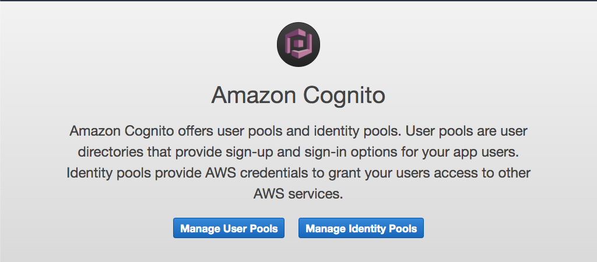

# Agnita: Authentication for Create React App using AWS Cognito

The Agnita project is a proof of concept implementation using [Amazon Cognito](https://aws.amazon.com/cognito/) and [create-react-app](https://create-react-app.dev/).

The name Agnita comes from Latin and means recognized. The name was chosen in close relation to Cognito. Finding a suitable name took me quite some time and is utterly useless.

## Setting up AWS Cognito

Make sure you have an AWS account, I suggest you use the [free tier](https://aws.amazon.com/free/) to get started.
Go to the [Cognito](https://console.aws.amazon.com/cognito/) service in the [AWS Management Console] and click on Manage User Pools.

Now click on Create a user pool to create your first user pool.

In the next step you have to give your user pool a name, I named mine Agnita because, well, that's the name of my app. By clicking on Review Defaults you trust on AWS Cognito to make most of the hard choices in the settings. For a proof of concept I sure hope the defaults will be sufficient.

As far as I know, those defaults look good. Since you are reading this, you probably don't have a clue either. So you can click on Create pool and see your first AWS Cognito user pool.

