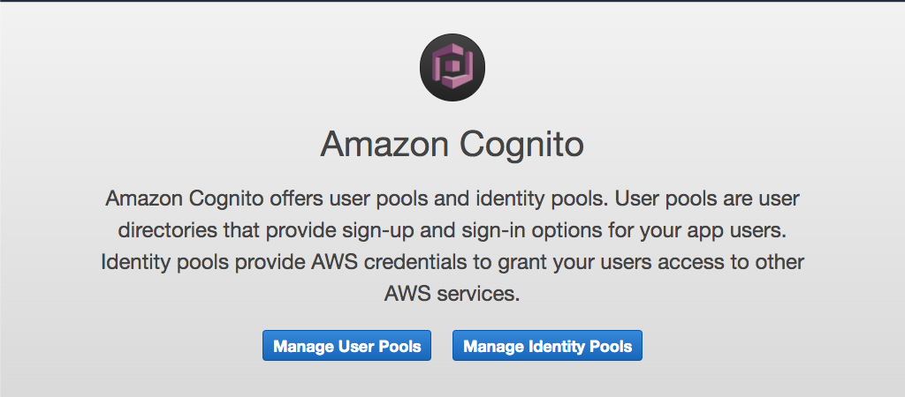
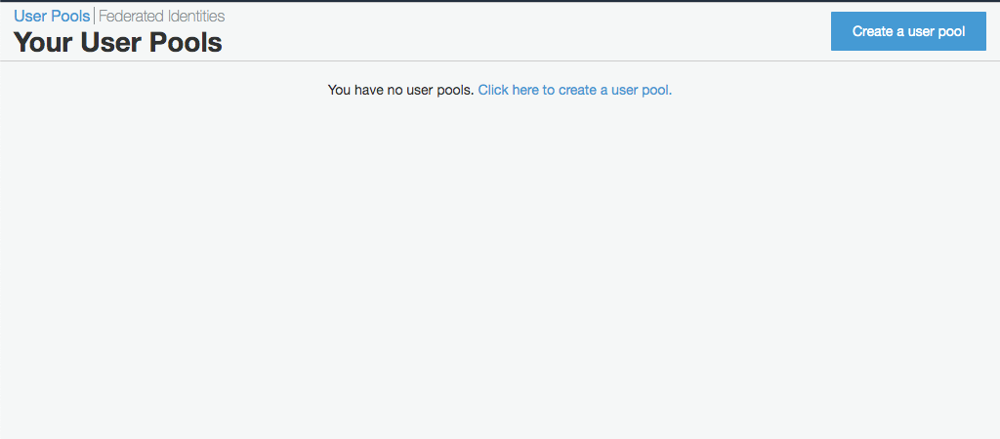
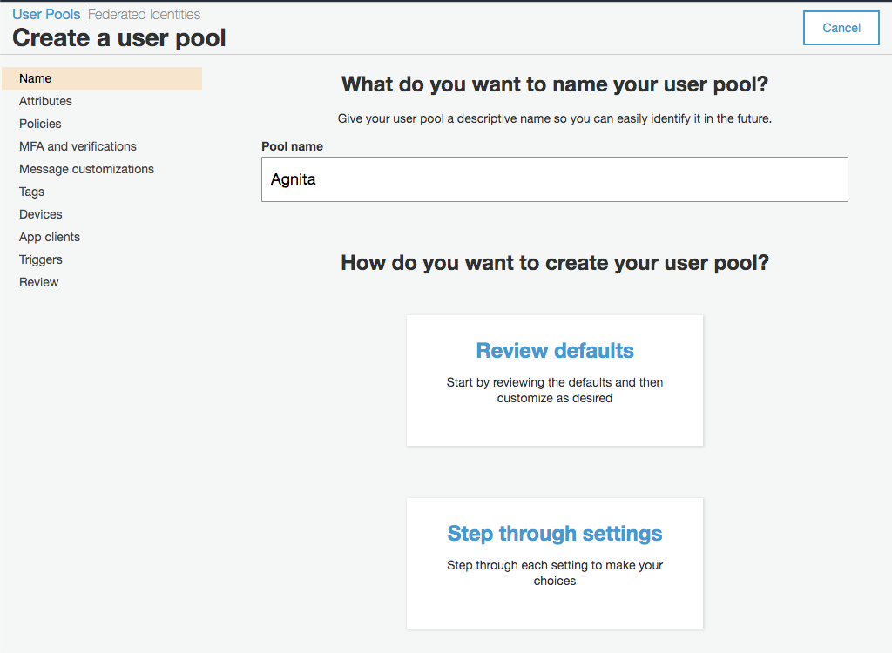
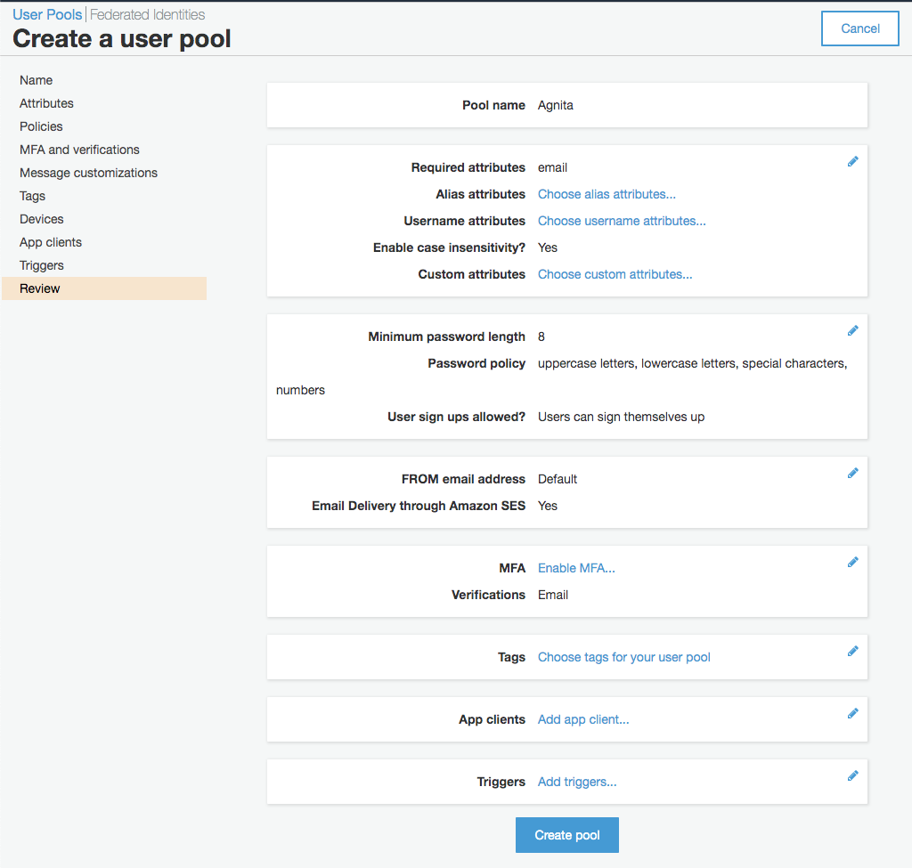
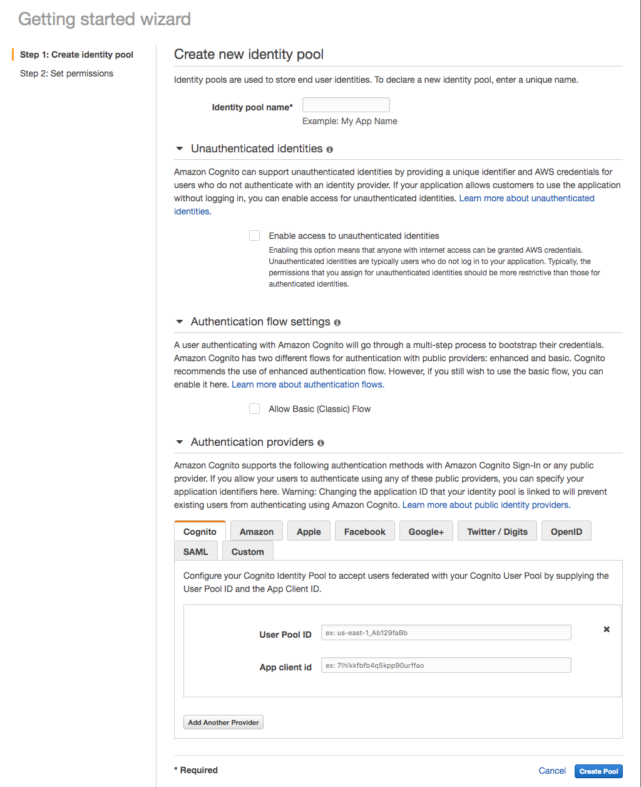
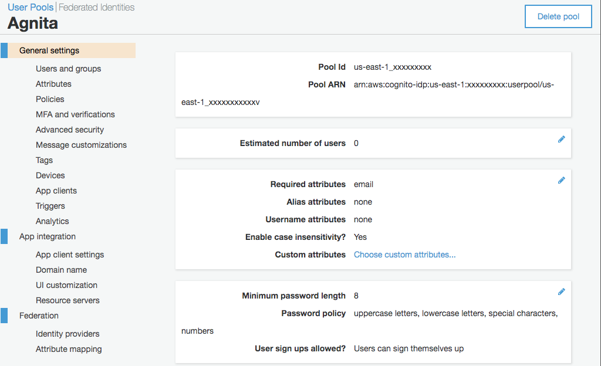
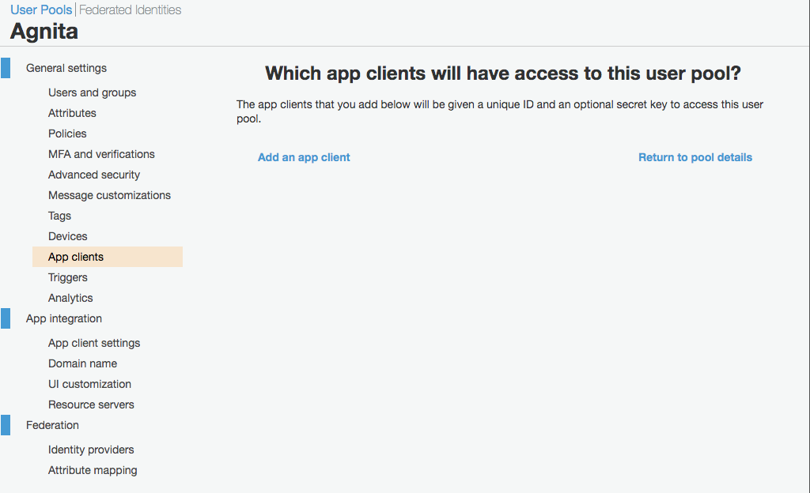
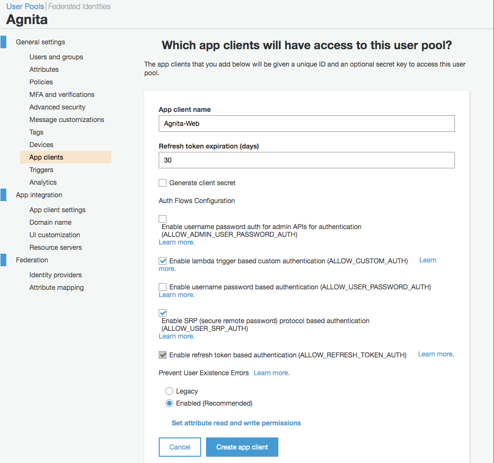
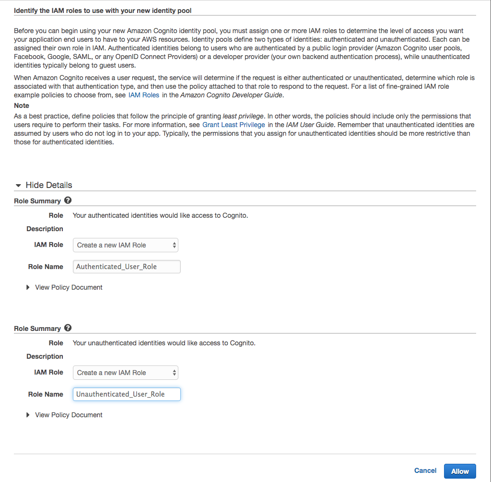

# Agnita: Authentication for Create React App using AWS Cognito

The Agnita project is a proof of concept implementation using [Amazon Cognito](https://aws.amazon.com/cognito/) and [create-react-app](https://create-react-app.dev/).

The name Agnita comes from Latin and means recognized. The name was chosen in close relation to Cognito. Finding a suitable name took me quite some time and is utterly useless.

## Setting up AWS Cognito

Make sure you have an AWS account, I suggest you use the [free tier](https://aws.amazon.com/free/) to get started.
Go to the [Cognito](https://console.aws.amazon.com/cognito/) service in the [AWS Management Console] and click on Manage User Pools.



Now click on Create a user pool to create your first user pool.



In the next step you have to give your user pool a name, I named mine Agnita because, well, that's the name of my app. By clicking on Review Defaults you trust on AWS Cognito to make most of the hard choices in the settings. For a proof of concept I sure hope the defaults will be sufficient.



As far as I know, those defaults look good. Since you are reading this, you probably don't have a clue either. So you can click on Create pool and see your first AWS Cognito user pool.



Back to the [Cognito](https://console.aws.amazon.com/cognito/) service in the [AWS Management Console] but this time you click on Manage Identity Pools.


Time to come up with another name, I just went with Agnita again. You can ignore the Unauthenticated identities and the Authentication flow settings. But you should expand the Authentication providers.

The first Authentication-providers-tab is Cognito and you can fill in the User Pool ID of the User Pool you just created in there. But an App client id is also required. What I did was open another browser tab to create an App client.



If you once again go to Cognito, I'm not going to put that screenshot up again, and then Manage User Pools you can select your User Pool. Under General Settings there is an option App clients. I think that's where you can create that much needed App Client.



Looks like I was right. You can click Add an client.



Guess what name I chose for my app client? That's right Agnita but I added -Web just because. You should also disa ble the Generate client secret checkbox. I left all other settings alone, so you can do that too, and I clicked Create app client.



Now you can continue with the identity pool. Paste your id's and hit Create Pool!

An unexpected screen appeared. Apparantly you also need to specify at least one role. I guess that makes sense. I'm only interested in one kind of authenticated user so I'm going to keep it simple.



That did the trick. Now you can start using Cognito from a website.

## Setting up Create React App

Make sure you have [Node.js](https://nodejs.org/) installed. I also like to use [Visual Studio Code](https://code.visualstudio.com/) because it works.

Open a terminal and start typing like a madman.

```shell
npx create-react-app agnita
cd agnita
code .
```

If everything went well you should be in Visual Studio Code with your just generated create-react-app in ready.

### Prettier detour

Before I can start working on a JavaScript project I always make sure [Prettier](https://prettier.io/) is installed. It's just so much faster to code if you can auto-format every 3.8 secondes.

When I'm in Visual Studio Code I always use the built in terminal. You can show the integrated terminal by using the ⌃` (control + backtick) shortcut when you're on [macOS](https://code.visualstudio.com/shortcuts/keyboard-shortcuts-macos.pdf) like me. The same Visual Studio keyboard shortcut also exists for [Windows](https://code.visualstudio.com/shortcuts/keyboard-shortcuts-windows.pdf) and [Linux](https://code.visualstudio.com/shortcuts/keyboard-shortcuts-linux.pdf).

Now back to Prettier. After installing Prettier and creating an empty config you can hit ⇧⌥F (shift + command + f) when you are working in a file to format it.

```shell
npm install --save-dev prettier
echo "{}" >> .prettierrc
```

### Back on track

Just to be sure everything went right before you start integrating AWS Cognito, you can start the generated app. Back to the terminal:

```shell
npm start
```

I don't know about you but for me this opened up a browser tab and showed a spinning [React](https://reactjs.org/) logo.

### AWS Amplify

To register, log in and log out using AWS Cognito you need [AWS Amplify](https://aws-amplify.github.io/). AWS Amplify is a full fledged library to build apps on AWS. I'm only going to use AWS Cognito for now so I mainly focus on the [Manual Setup](https://aws-amplify.github.io/docs/js/authentication#manual-setup) part of the documentation.

```shell
npm install --save aws-amplify
```

The `.env` file is where you should save your AWS Cognito id's. It's best not to check those in because other people might start using your user pool to store their users. So make sure to add `.env` to your `.gitignore` to exclude it from Git. 

You do know [Git](https://git-scm.com/) do you? If you don't, you should learn it, just read the first 3 chapters of [this free book](https://git-scm.com/book/en/v2).

```shell
touch .env
```

Your `.env` file should look something like the one below. 

> I used an unbreakable algorithm to change all the id's so don't try anything. Actually I just typed in some random characters instead of the real id but it will get the job done.

```
REACT_APP_REGION=us-east-1
REACT_APP_USER_POOL_ID=us-east-1_DeDry2ddr
REACT_APP_USER_POOL_WEB_CLIENT_ID=1nuadrbtwes5o6vjriuu34803f
REACT_APP_DOMAIN=my.domain.com
REACT_APP_REDIRECT=http://localhost:3000/
```